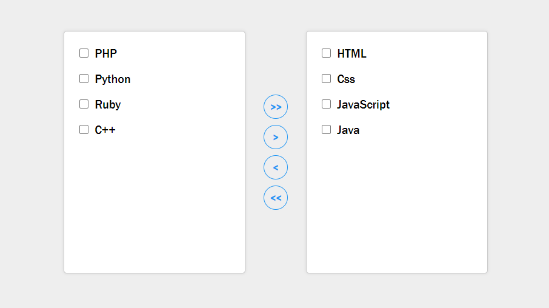

# JS List switcher

I attended in a Front-end challenge, and this was one of project task.

**Description:**

A Javascript (web-based) page to move the items between two column something like Karbon and you can easily move all items of left ro right, or select and move one by one to next side.

